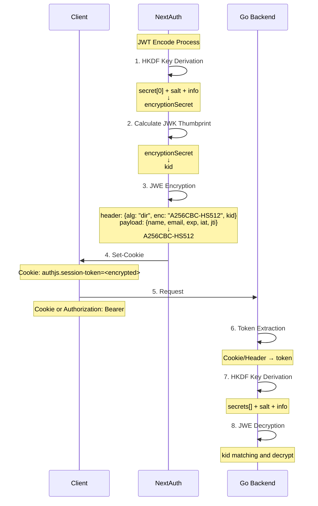

# NextAuth.js and Go Backend JWT Flow

## Sequence Diagram

## Technical Details

### Key ID (kid) Matching Process

The `kid` matching process is a crucial security mechanism in the JWT validation flow between NextAuth.js and the Go backend. Here's how it works:

1. **Token Header Parsing**
   - The JWE token is split into its components
   - The header is base64-decoded and parsed
   - Contains critical information: `kid` (Key ID), `enc` (Encryption Algorithm), `alg` (Key Management Algorithm)

2. **Key Derivation**
   - Both NextAuth.js and Go backend use HKDF (HMAC-based Key Derivation Function)
   - Components:
     - Secret: The shared NEXTAUTH_SECRET
     - Salt: Cookie name ("authjs.session-token")
     - Info: "Auth.js Generated Encryption Key"
   - Output: A symmetric key for A256CBC-HS512 encryption (64 bytes)

3. **Encryption/Decryption**
   - Algorithm: A256CBC-HS512 (AES-256-CBC with HMAC-SHA-512)
   - Direct key agreement ("dir") means the derived key is used directly
   - The `kid` in the header helps identify which secret was used for key derivation
